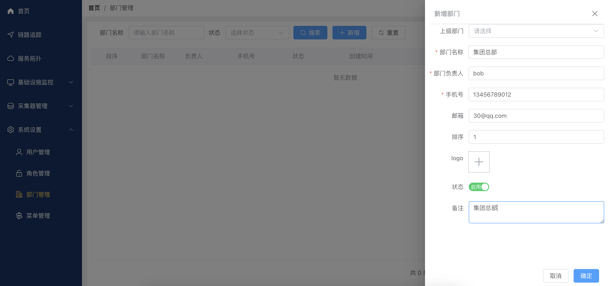

#部门管理使用说明
本文档将指导您如何使用部门管理功能，包括部门的新增、修改和删除。

### 点击左侧导航栏“部门管理”，进入部门管理页面。
- 查询部门
部门名称搜索框：输入部门名称以查找特定部门。
状态下拉框：选择部门状态进行筛选。
- 搜索按钮：点击进行搜索操作。
- 重置按钮：清空搜索条件，显示所有部门。
- 支持分页显示，每页显示10条记录。

### 点击“新增部门”按钮，弹出新增部门对话框。
填写以下信息：
- 上级部门：选择部门的父级，若无父级，不用选择。
- 部门名称（必填）：输入部门名称。
- 部门负责人：输入部门负责人的姓名。
- 手机号（必填）：输入负责人的联系电话。
- 邮箱：输入负责人的电子邮箱。
- 排序：输入部门的显示顺序。
- logo：上传部门的标志图片。
- 状态：选择部门的状态（启用/禁用）。
- 备注：输入关于部门的备注信息。
- 点击“确定”按钮，完成部门的新增。

### 修改部门
- 在部门列表中找到需要修改的部门。
- 点击部门项后面的修改按钮。
- 反显原有部门信息，根据需要修改所需信息。
- 点击 “确定” 保存修改；点击 “取消” 取消修改。

### 删除部门
- 在部门列表中找到需要删除的部门。
- 点击部门项后面的删除按钮。
- 在弹出的确认对话框中点击 “确定” 完成删除。

### 注意事项
1. 新增或修改部门时，“部门名称”和“手机号”是必填项。
2. 请确保部门信息的准确性，特别是负责人的联系信息。
如有其他问题，请联系系统管理员。