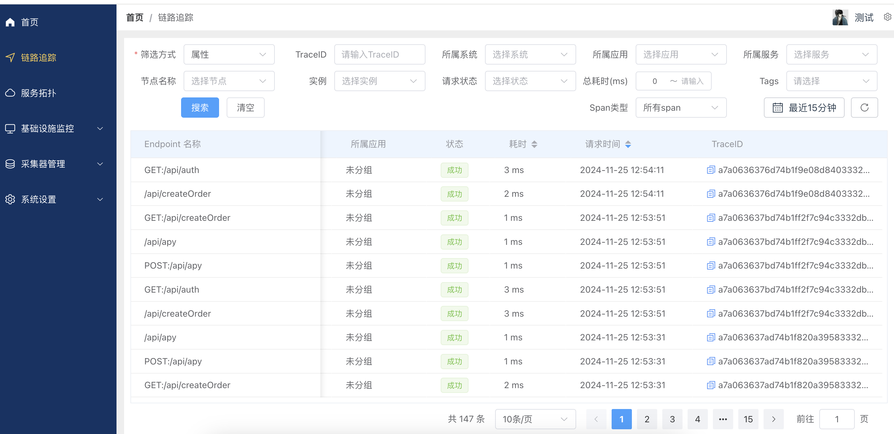
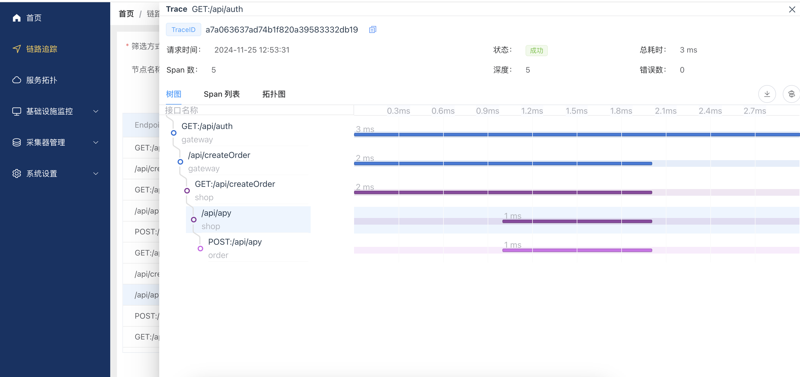
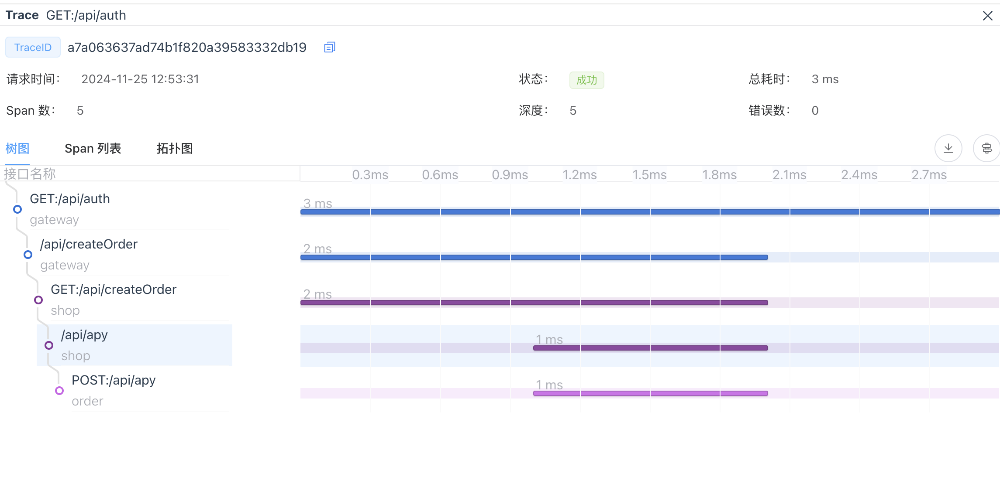
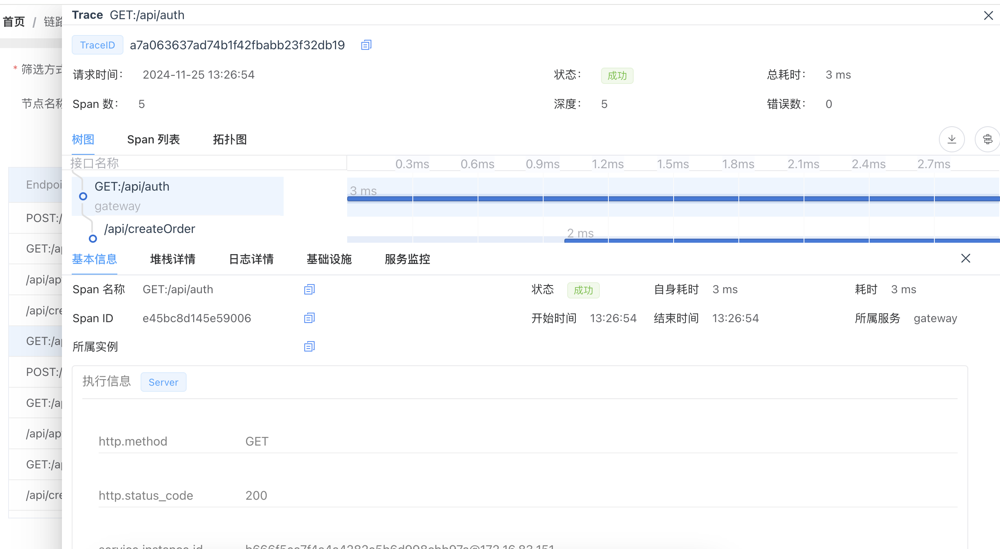
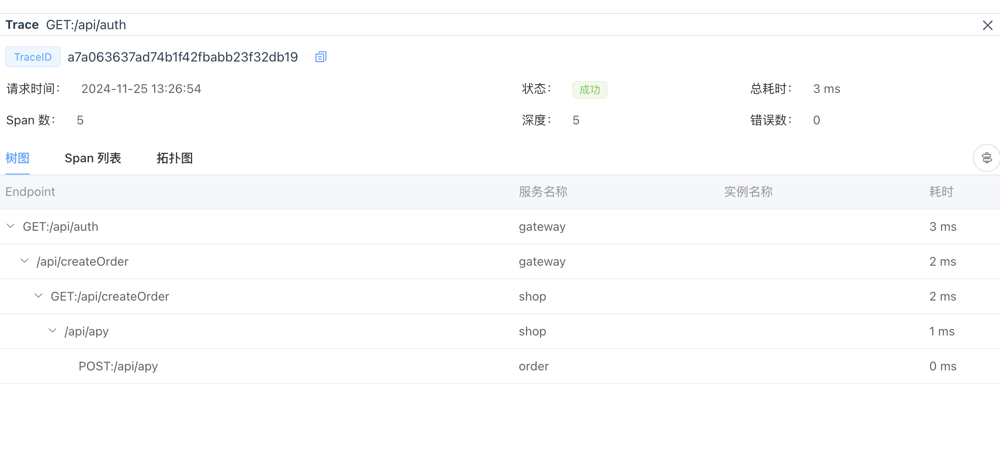
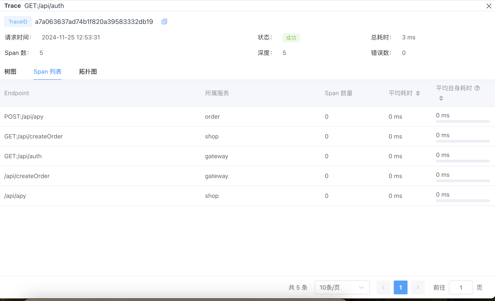
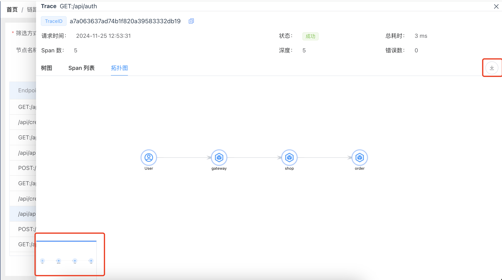

# 链路追踪使用说明
>用于链路追踪和性能监控，帮助用户分析请求在不同节点的耗时和状态。

### 链路列表

1. 点击左侧导航栏“链路追踪菜单”，进入链路追踪页面。
2. 筛选条件
筛选方式: 选择请求属性进行筛选。
节点名称: 筛选具体节点。
TraceID: 输入特定请求的TraceID进行跟踪。
所属系统: 选择系统进行筛选。
所属应用: 筛选特定应用请求。
所属服务: 筛选服务。
实例: 筛选实例。
请求状态: 筛选请求成功或失败的状态。
总耗时(ms): 输入耗时范围进行筛选。
Tags: 根据标签筛选。
Span类型: 筛选特定Span类型。
时间范围选择: 例如“最近15分钟”。
3. 操作按钮
搜索: 根据当前筛选条件进行查询。
清空: 清除所有筛选条件。
4. 表格展示信息
Endpoint名称: 请求的具体接口。
所属服务: 请求所归属的服务。
所属应用: 请求所属应用。
状态: 显示请求成功与否。
耗时: 请求的处理时间。
请求时间: 请求发生的实际时间。
TraceID: 请求的唯一标识符。
5. 支持分页功能，默认每页显示10条数据。

### 详情页面

1. 点击表格中的某一项，进入详情页面。
2. 请求基础信息
TraceID: 请求的唯一标识符。
请求时间: 此请求的发起时间。
Span数: 请求中包含的Span总数。
状态: 请求的最终执行状态。
深度: 请求的嵌套层级。
总耗时: 请求的总时间消耗。
错误数: 请求过程中产生的错误数量。
3. 视图选择
树图: 显示请求各个节点的调用层级关系。
Span列表: 按时间排序列出所有Span信息。
拓扑图: 视觉化显示服务调用的整体关系。

### 详情tab-树图

1. 通过缩进树，展示了请求名称和请求耗时，方便查看请求耗时时间。
2. 点击树图中的某一项，可查看该Span的详细信息。包含：基本信息、堆栈详情、日志详情

- 基本信息
Span名称: 显示本次请求的接口路径。
Span ID: 唯一标识符，用于区分不同请求。
所属实例: 显示请求所属的具体实例信息。
状态: 请求的处理状态，如成功或失败。
自身耗时: 该Span的执行耗时。
耗时: 包含子调用的总耗时。
开始时间: 请求开始的具体时间。
结束时间: 请求结束的具体时间。
所属服务: 请求所归属的服务。
- 执行信息
http.method: HTTP请求方法（如GET、POST）。
http.status_code: 请求返回的HTTP状态码。
service.instance.id: 服务实例的标识符，包含地址信息。
service.name : 服务名称。
sw8.componentId : 服务组件ID。
sw8.parent_span_id : 父Span的ID。
sw8.peer : 远程服务地址。
sw8.segment_id : 请求的唯一标识符。
sw8.span_id : 该Span的唯一标识符。
sw8.trace_id : 请求的唯一标识符。
token : 请求的鉴权信息。
url : 请求的URL。
url.full : 请求的完整URL。
3. 支持下载树图数据。
4. 可切换表格视图。

支持展开和收起。

### 详情tab-Span列表

1. span列表按时间排序，展示了请求中所有的Span信息。
2. 表格信息展示
Endpoint名称: 请求的具体接口。
所属服务: 请求所归属的服务。
Span数量: 该Span包含的子Span数量。
平均耗时: 该Span的平均耗时。
平均自身耗时: 该Span的平均自身耗时。
3. 支持分页功能，默认每页显示10条数据。

### 详情tab-拓扑图

1. 视觉化显示服务调用的整体关系。
2. 视图支持缩放、平移、拖动。
3. 支持小公具窗口展示。
4. 拓扑图支持下载。
